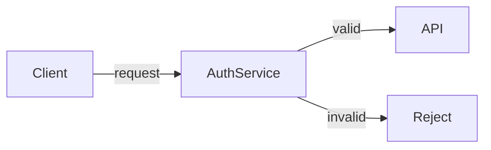

# Lists, Tables, and Code Examples

Apply these rules whenever choosing between prose, bullets, numbered steps, tables, or code blocks — and when formatting code, UI references, and figures inside any of them. The choice of container is part of the meaning; a list versus a table versus prose tells the reader how to read the content.

## Choosing the Container

The container you pick signals how the content should be read: bulleted lists for unordered sets, numbered lists for sequences whose order carries meaning, tables for items compared across a shared set of attributes, and prose for a single connected argument.

**Examples:**

> A set of options, a set of features, or a set of caveats reads naturally as a bulleted list because the reader could rearrange the items without loss of meaning.

> Comparing three database engines across cost, latency, and durability reads best as a table because the items share a consistent set of attributes worth comparing column-by-column.

**Guidelines:**

- SHOULD use a **bulleted list** when items are unordered and the reader could rearrange them without loss of meaning.
- SHOULD use a **numbered list** when order matters — procedures, ranked alternatives, or any sequence whose meaning changes when reordered.
- SHOULD use a **table** when items share a consistent set of attributes worth comparing column-by-column.
- SHOULD keep content as **prose** when it is genuinely a single connected argument; bulleting connected reasoning fragments it and removes the connective tissue.
- MAY express a list of two items as prose with "and"/"or"; promote to a list at three or more items, and at any count when the items are non-trivially long.
- MUST promote an "embedded list" inside a sentence ("…by first X, then Y, and finally Z…") to a real list when the sequence is the point of the sentence.

## Parallelism in List Items

List items in a single list should share grammatical form — the same part-of-speech start, the same approximate length, the same capitalization, and the same end punctuation. Items that resist parallelism are a signal that the list is heterogeneous and should be split rather than forced.

**Bad Examples:**

> A list whose first item is a noun phrase, second is an imperative sentence, and third is a question fails parallelism; fix the form before publishing.

**Guidelines:**

- MUST keep list items grammatically parallel — same part-of-speech start, same approximate length, same capitalization, same end punctuation.
- MUST keep capitalization and punctuation consistent across all items in one list — either every item is a complete sentence ending in a period, or every item is a noun phrase with no period; never mixed.
- SHOULD split a list whose items resist parallelism into two lists with different headings rather than forcing parallelism through awkward phrasing.

## Numbered Procedure Steps

Numbered steps describe actions the reader performs, so each step leads with an imperative verb and covers one user-visible action. Surfacing the expected result and any decision points keeps the reader oriented as they work through the procedure.

**Good Examples:**

> "…Run `npm install`. The command writes a `node_modules/` directory." — the expected result appears immediately after the step so the reader can verify before moving on.

**Bad Examples:**

> A command split across formatting that breaks the copy is a defect, not a style choice.

**Guidelines:**

- MUST start each numbered step with an imperative verb in second person — `Run`, `Open`, `Configure`, `Verify`.
- SHOULD describe one user-visible action per numbered step; if a step contains "and then", split it.
- SHOULD place the expected result of a step immediately after the step so the reader can verify before moving on.
- MUST call out decision points inside a procedure explicitly ("If the build fails with X, see Y") rather than burying them in a sentence the reader might miss.
- SHOULD make command steps copy-paste-runnable.

## Introducing Lists and Tables

Every list and table needs a lead-in sentence ending in a colon so the reader knows what they are about to scan; the heading describes the topic while the lead-in describes the list. Very long lists become unscannable and need sectioning, conversion, or splitting.

**Good Examples:**

> "The following flags control retry behavior:" — a lead-in ending in a colon that uses *following* because the list is on the same screen.

**Guidelines:**

- MUST introduce every list and table with a lead-in sentence ending in a colon.
- SHOULD use the word *following* (or *below*) in the lead-in when the list is on the same screen; avoid "the list" or "the table" as bare references when the reader can already see it.
- MUST NOT let a list or table appear as the only content under a heading with no introductory sentence.
- SHOULD section long lists (>~10 items) with sub-headings, convert them to a table, or split them — long flat bullet lists are unscannable.

## Tables

Tables earn their cost when the comparison axis is real and every column holds a single, parallel data type under a meaningful header. Keep cells short, keep the column order stable, and demote trivial two-column tables to a description list or prose.

**Good Examples:**

> A column header named "Latency (p95)" names the attribute being compared rather than the position.

**Bad Examples:**

> A "Type" column whose entries are sometimes a TypeScript type and sometimes a free-form description fails the predictability contract.

**Guidelines:**

- MUST give every column a meaningful header that names the attribute, not the position.
- SHOULD keep table cells to at most ~2 sentences; longer content belongs in prose with a reference to it, not crammed into a cell.
- MUST keep each column to a single, parallel data type.
- SHOULD keep a stable column order — when comparing alternatives, put the recommended choice first or last consistently across the document set.
- SHOULD express a table with only two columns and ~3 rows as a description list or prose instead.

## Code Examples

Code examples teach best when they are minimal, runnable, and framed by prose that says what the block shows and what to notice. Cut everything not load-bearing for the point, use realistic names, and verify the example before publishing.

**Good Examples:**

```ts
function retry(connection_pool: Pool, order_id: string) {
  return connection_pool.query("SELECT * FROM orders WHERE id = $1", [order_id]);
}
```

**Bad Examples:**

```ts
import { Pool } from "pg";
import { logger } from "./logging";
import { config } from "./config";

const foo = new Pool(config.db);
logger.info("starting");
function bar(baz: string) {
  // unrelated scaffolding that obscures the point
  return foo.query("SELECT * FROM orders WHERE id = $1", [baz]);
}
```

**Guidelines:**

- MUST keep code examples minimal — show only what illustrates the point; cut imports, scaffolding, and unrelated logic that is not load-bearing.
- SHOULD make examples runnable as written when possible; a snippet that requires the reader to invent missing context teaches less than a complete-but-small one.
- SHOULD use realistic names (`order_id`, `connection_pool`) over `foo`, `bar`, `baz`; placeholder names obscure which positions are user-controllable.
- SHOULD precede a code block with a sentence stating what it shows and follow it with a sentence interpreting the result or pointing out the salient line.
- SHOULD break long examples (>~30 lines) into stepwise blocks with prose between them, or move them to a linked file / repo with the document showing only the salient excerpt.
- MUST test or otherwise verify examples before publication; an example with a typo or stale API call is worse than no example because it actively misleads.

## Inline Formatting

Inline formatting maps meaning to typography: monospace for code and literal values, bold for UI element names, and sparing italics for term introduction or single-word emphasis. The conventions chosen in one section must hold across the whole document.

**Examples:**

> "Click **Save**" formats the UI button label in bold, while `npm install`, `src/index.ts`, and `MAX_RETRIES` are in monospace.

**Guidelines:**

- SHOULD format inline code, file paths, command names, identifiers, and literal values in `monospace` (backticks).
- SHOULD format UI element names (button labels, menu items, tab names) in **bold** when describing user-interface flows.
- SHOULD use *italics* sparingly, for term introduction or for emphasis on a single word; italicizing whole phrases for emphasis is shouting on a screen.
- MUST NOT mix conventions within a document — if file paths are in code font in section 1, they MUST be in code font in section 7.

## Diagrams

Author diagrams in [Mermaid](https://mermaid.ai/open-source/intro/) so they stay diffable, version-controllable, and editable in the same review as the prose; flowcharts, sequence, state, ER, Gantt, and class diagrams all have native syntax. Pick the diagram type that matches the relationship, keep each diagram focused on one idea, and reuse the prose's vocabulary in labels.

**Example:**



**Guidelines:**

- MUST author diagrams in [Mermaid](https://mermaid.ai/open-source/intro/) — flowcharts, sequence diagrams, state diagrams, ER diagrams, Gantt charts, and class diagrams all have native Mermaid syntax.
- MUST embed Mermaid diagrams in fenced code blocks tagged ` ```mermaid ` so renderers display the rendered figure instead of the source.
- SHOULD pick the Mermaid diagram type that matches the relationship being shown — `flowchart` for control / data flow, `sequenceDiagram` for cross-component message order, `stateDiagram-v2` for lifecycle, `erDiagram` for data modeling, `classDiagram` for type hierarchies.
- SHOULD keep each diagram focused on one idea — a Mermaid diagram with >~15 nodes or crossed edges is unreadable; split into two diagrams or move detail into prose.
- SHOULD use the same vocabulary in node and edge labels as the surrounding prose; a diagram that names a component `AuthSvc` while the text calls it `auth-service` forces the reader to translate.
- MUST NOT rely on Mermaid styling (colors, themes) to carry meaning the text does not also state (see [voice-tone-and-maintenance.md](./voice-tone-and-maintenance.md)).
- SHOULD replace a raster image (PNG, JPG) of a conceptual diagram with a Mermaid source; reserve raster images for screenshots of real UIs, photos, or hand-drawn sketches that genuinely cannot be expressed as code.
- MUST commit the source file alongside the exported image when a diagram tool other than Mermaid is genuinely required (e.g., Excalidraw, draw.io), so the diagram remains editable.

## Figure and Table Captions

A caption describes what the reader is looking at, not what the writer drew, and should stand on its own so a reader who reads only the caption understands the figure's point. Images need alt text for screen readers and load failures, and Mermaid diagrams need a paired prose summary for readers who skim without rendering.

**Good Examples:**

> "Request flow during a cache miss" describes what the reader is looking at, rather than "Diagram 1".

**Guidelines:**

- SHOULD give a figure or table a short caption that describes what the reader is looking at, not what the writer drew.
- SHOULD make captions self-contained — a reader who reads only the caption SHOULD understand the figure's point.
- MUST include alt text on an image describing the content for screen readers and for cases where the image fails to load; a chart's alt text describes the trend and the takeaway, not the visual style.
- SHOULD pair a Mermaid diagram with a caption and a one-sentence prose summary of its point — readers who skim the prose without rendering the diagram still need the takeaway, and the summary doubles as the diagram's accessible description.
- MUST NOT include a decorative-only figure (a stock illustration with no information) in a technical document.
